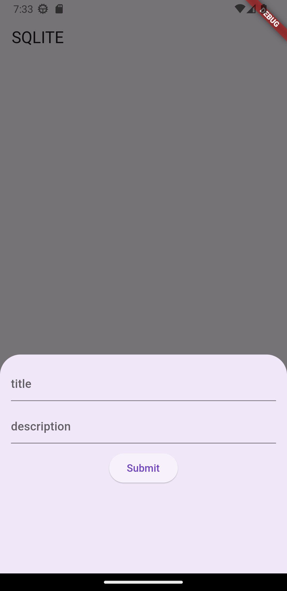
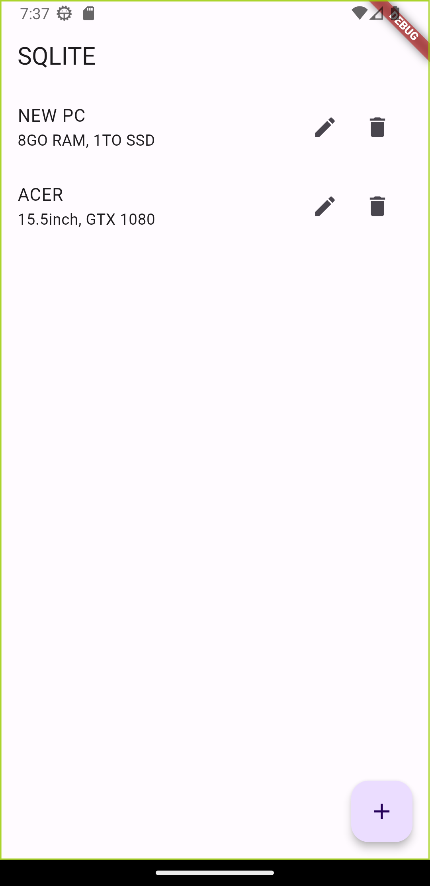

# SQLite Tutorial Mobile App with Flutter and Dart

<div style="display: flex;">
  
  
</div>

## Overview

This repository contains a mobile app built with Flutter and Dart that serves as a comprehensive tutorial on using the SQLite database in Flutter applications. The app demonstrates how to leverage the "sqlite" package to implement various features in a simple and intuitive way.

SQLite is a popular choice for local data storage in mobile applications due to its lightweight nature and simplicity. This tutorial app covers essential concepts and provides practical examples to guide developers through the process of integrating SQLite into their Flutter projects.

## Features

- Create a new SQLite database.
- Define a database table schema and set up relationships.
- Perform CRUD (Create, Read, Update, Delete) operations on the database.
- Utilize asynchronous methods for smooth UI interactions.
- Handle errors and exceptions gracefully.
- Implement complex queries for advanced data retrieval.
- Demonstrate best practices for efficient database management.

## Getting Started

Follow these steps to set up the project and run the app on your local machine:

1. **Prerequisites:** Make sure you have Flutter installed on your system. If not, you can follow the official Flutter installation guide: [Flutter Installation Guide](https://flutter.dev/docs/get-started/install)

2. **Clone the repository:** Use Git to clone this repository to your local machine.

```bash
git clone https://github.com/your-username/sqlite-tutorial-flutter.git
cd sqlite-tutorial-flutter
```


3. **Install dependencies:** Fetch the required packages by running the following command in the terminal:

```bash
flutter pub get
```

4. **Run the app:** Connect your mobile device/emulator, and use the following command to run the app:

```bash
flutter run
```


## Contributing

Contributions to this tutorial app are welcome! If you find any issues or would like to add new features, follow these steps:

1. Fork the repository.

2. Create a new branch: `git checkout -b my-feature-branch`

3. Make your changes and commit them: `git commit -m "Add new feature"`

4. Push to the branch: `git push origin my-feature-branch`

5. Submit a pull request explaining the changes you've made.

Please ensure that your code follows the Flutter and Dart best practices and is thoroughly tested.

## License

This project is licensed under the [MIT License](LICENSE). Feel free to use, modify, and distribute the code for both personal and commercial purposes.

## Acknowledgments

Special thanks to the Flutter community for their support and the creators of the "sqlite" package for providing a powerful tool for local database management in Flutter apps.

## Contact

For any questions or feedback regarding the project, you can reach out to the project maintainer:

- Name: Adel Merioua
- Email: meriouaadel22@.com
- GitHub: [Your GitHub Profile](https://github.com/ADEL-tec)

Happy coding!


